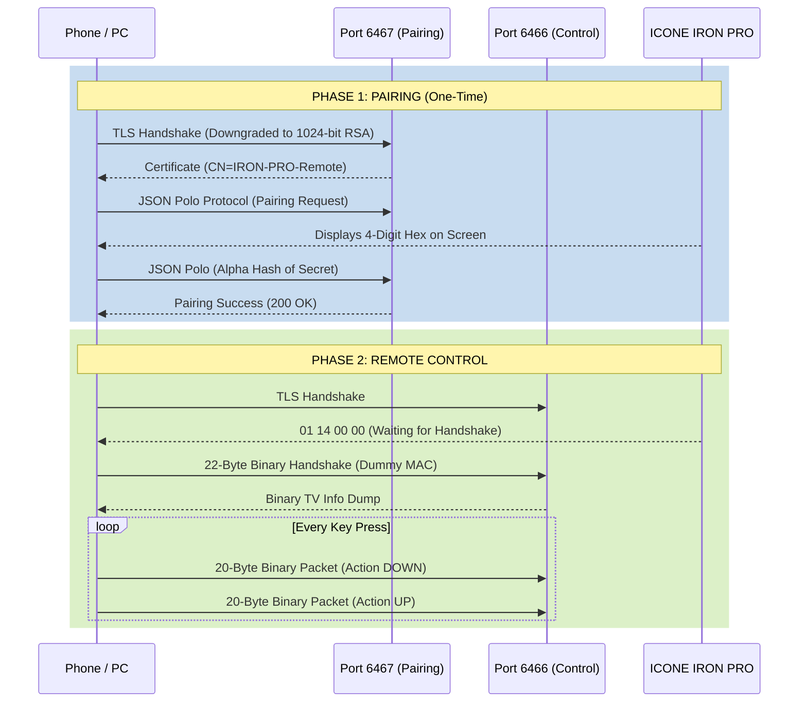

# ICONE / HiSilicon Protocol Documentation

This document serves as a technical reference for researchers and developers interacting with proprietary HiSilicon-based Android TV boxes. It details the reverse-engineered pairing and remote control protocols.

## Published Findings

| Property | Value |
| :--- | :--- |
| **Device Model** | ICONE IRON PRO (Identifies as `HiSTBAndroidV6/Hi3798MV200`) |
| **Android Version** | 7.0 (`NRD90M`) |
| **Certificate CN** | `IRON-PRO-Remote` |
| **Chipset Family** | HiSilicon Hi3798MV200 |

### Key Differences from Google's Android TV Remote v2
Standard Android TVs (Android 10+) use Google's official Remote Protocol v2 which mandates:
1. **Security:** Modern TLS (2048-bit RSA or better).
2. **Pairing (6467):** Protobuf payloads over TLS.
3. **Control (6466):** Protobuf payloads (`remotemessage.proto`) over TLS.

This custom HiSilicon firmware drastically deviates from the standard:
1. **Security:** Hardcoded legacy **1024-bit RSA** certificates (Rejected by default OpenSSL configurations).
2. **Pairing (6467):** Uses JSON-encoded payloads over TLS instead of Protobufs.
3. **Control (6466):** Completely ignores Protobufs. Implements a proprietary, undocumented **Binary Packet** protocol over TLS.

---

## Architecture Diagram



---

## TLS Requirements
To successfully connect to either port `6466` or `6467`, the client **must**:
1. Generate a client certificate with a **1024-bit RSA Key**.
2. Downgrade the TLS security level to allow weak ciphers/keys. In Python, this is achieved via:
   ```python
   ctx.set_ciphers('DEFAULT@SECLEVEL=0')
   ```

---

## 1. Pairing Protocol (Port 6467)
Pairing is handled via JSON objects sent over the TLS connection. The messages mirror the structure of the standard Google Polo Protocol but are serialized as JSON instead of Protobufs.

**Message Format:**
Length-prefixed JSON strings. Each payload is a JSON object containing a `type`, `status`, and `payload` object.

1. **Client Request:** `{"type": 10, "protocol_version": 1, "payload": {"client_name": "PythonClient", "client_role": 1}}`
2. **Server Response:** `<TV displays hex code>` -> `{"type": 11, ...}`
3. **Client Options:** `{"type": 20, ...}`
4. **Client Secret:** Computes the SHA-256 Alpha hash of the 4-digit hex code provided by the TV and sends it Base64 encoded.
   `{"type": 40, "payload": {"secret": "BASE_64_HASH"}}`
5. **Server Success:** `{"type": 41, ...}`

---

## 2. Remote Control Protocol (Port 6466)
The control port uses a strict binary protocol.

### The Handshake Packet (22 Bytes)
Immediately upon connecting to port 6466, the client must send a 22-byte initialization packet. If this is not sent, all subsequent commands are ignored.

| Bytes | Description | Value |
| :--- | :--- | :--- |
| `0` | Message Type | `0x01` |
| `1` | Subtype | `0x00` |
| `2-3` | Payload Length | `0x00 0x12` (18 bytes) |
| `4-7` | Param 1 | `0x00 0x00 0x00 0x01` |
| `8-11` | Param 2 | `0x00 0x00 0x00 0x01` |
| `12` | Flags | `0x20` |
| `13` | Protocol Version? | `0x03` |
| `14-16` | Padding | `0x00 0x00 0x00` |
| `17-20` | String Length | `0x00 0x00 0x00 0x11` (17 bytes for MAC) |
| `21+` | Dummy MAC String | e.g. `"aa:bb:cc:dd:ee:ff"` |

**TV Response:** The TV will respond with a large binary blob containing the device model (`ICONE IRON PRO`) and Android version string (`NRD90M`).

### The Key Injection Packet (20 Bytes)
Keystrokes are sent as 20-byte packets. A complete button press requires sending an `ACTION_DOWN` packet followed immediately by an `ACTION_UP` packet.

| Bytes | Description | Value |
| :--- | :--- | :--- |
| `0` | Message Type | `0x01` |
| `1` | Subtype | `0x02` |
| `2-3` | Payload Length | `0x00 0x10` (16 bytes) |
| `4-11` | Timestamp / Sequence | Long Integer (e.g. `time.time()`) |
| `12-15` | Action | `0x00` (DOWN) or `0x02` (UP) |
| `16-19` | Keycode | Standard Android `KeyEvent` Integer |

---

## 3. Supported Key Codes
The protocol accepts standard Android `KeyEvent` integers. However, specialized hardware buttons (like `INFO` or `FAVORITE`) are mapped strictly to the hardware IR receiver and are **not** accessible via the IP protocol.

### Standard Navigation & Volume
| Action | Key Code |
| :--- | :--- |
| **UP** | 19 |
| **DOWN** | 20 |
| **LEFT** | 21 |
| **RIGHT** | 22 |
| **OK / ENTER** | 23 or 66 |
| **HOME** | 3 |
| **BACK / EXIT** | 4 |
| **MENU** | 82 |
| **VOLUME UP** | 24 |
| **VOLUME DOWN** | 25 |
| **MUTE** | 164 |

### Media Controls
| Action | Key Code |
| :--- | :--- |
| **PLAY / PAUSE** | 85 |
| **STOP** | 86 |
| **FAST FORWARD** | 90 |
| **REWIND** | 89 |
| **NEXT** | 87 |
| **PREVIOUS** | 88 |
| **RECORD** | 130 |

### Miscellaneous
| Action | Key Code |
| :--- | :--- |
| **POWER (Sleep/Wake)** | 26 |
| **0-9 Numbers** | 7 through 16 |
| **TV SOURCE** | 178 |
| **EPG / VOD** | 172 |
| **RED, GREEN, YELLOW, BLUE** | 183, 184, 185, 186 |

### App Launch Commands
*(Currently untested)* Since this protocol accepts standard `KeyEvent` injection rather than Intent URIs, launching specific apps (like Netflix or YouTube) requires either:
1. Navigating the UI dynamically (using directional key sequences).
2. Using custom hotkeys if they were assigned in the TV's firmware (e.g. `KEYCODE_PROG_RED` mapped to a specific app).
Standard Android TV deep-links (`vnd.youtube://`) cannot be injected via this 20-byte key packet.
